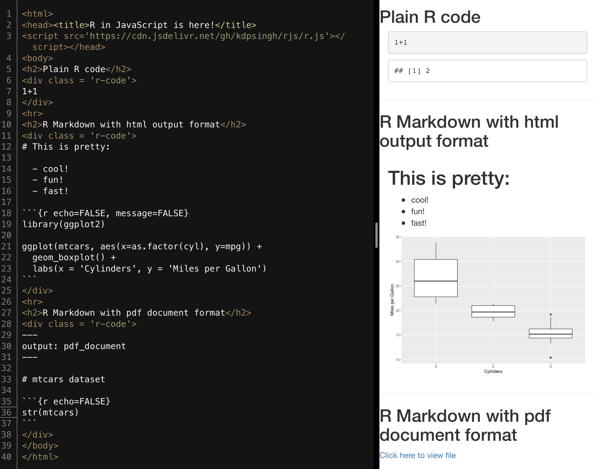
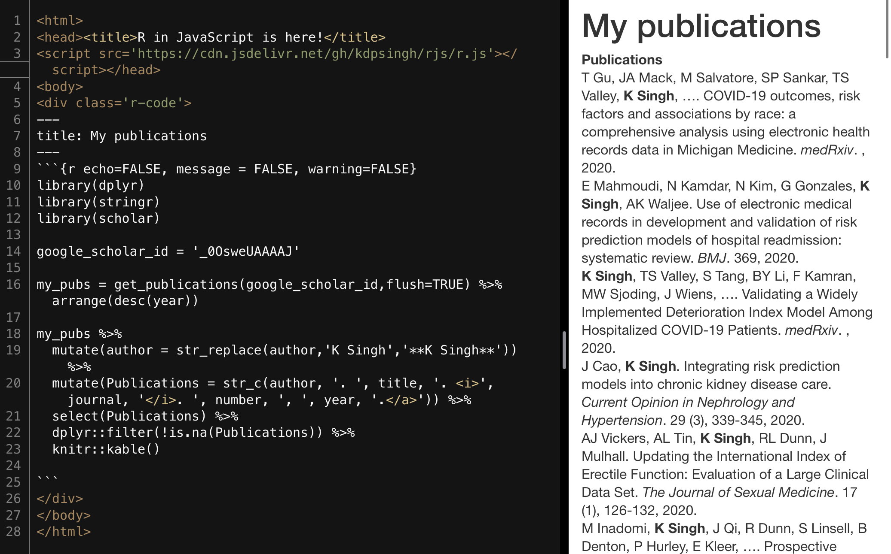

# rjs: R in JavaScript

Introducing R in JavaScript, a way to insert R code directly into websites, powered by [OpenCPU](https://github.com/opencpu/opencpu).

You can use it in 3 easy steps.

## Step 1
Add `` anywhere in your html file (or download `r.js` locally).

## Step 2
Add `class = "r-code"` to any html element containing `R` or `Rmd` code.

That's it.

After `rjs` runs, the `class` will be changed to `"r-code-output"`. You can run R code dynamically in JavaScript by setting the class of any HTML element to `"r-code"` and then calling `rjs();`.

## Step 3 (optional)

Want to bring your R workspace with you? No problem. Add `file = "filename.RData"` to the same HTML element containing `class = "r-code"`, and `rjs` will automatically load the `.RData` file before running your code.

A single `.RData` file can contain multiple R objects, so be sure to save all the objects you will need in a single `.RData` file. Make sure you don't include any sensitive information in the `.RData` file because it will be uploaded to a public server.

## `rjs` can:
- Auto-detect and process both `R` and `Rmd` formats
- Handle special characters in the input
- Render to non-html formats such as pdf_document (`rjs` automatically provides a link to the file)
- Load a local R workspace file (an `.RData` file)

## For ideas on how to get started, take a look in the `examples` folder:

### intro.html

### scholar.html

